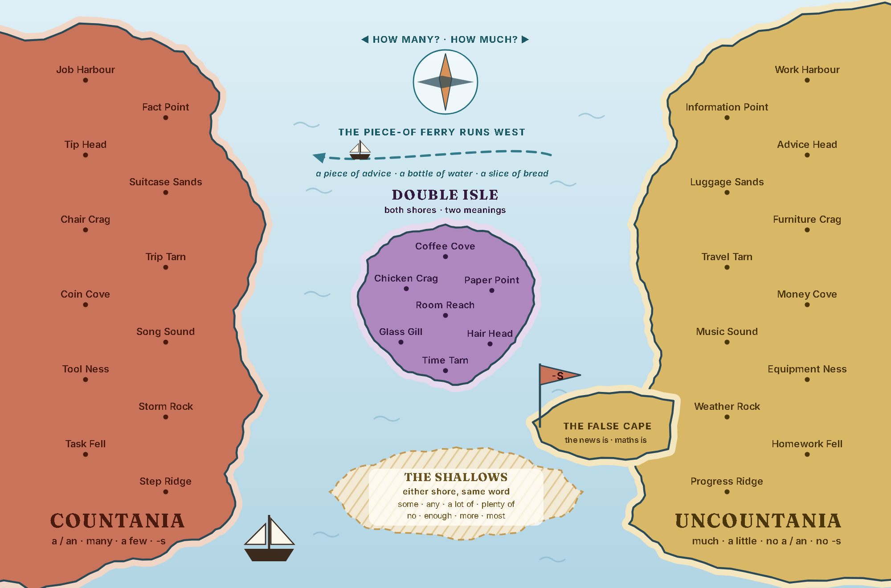
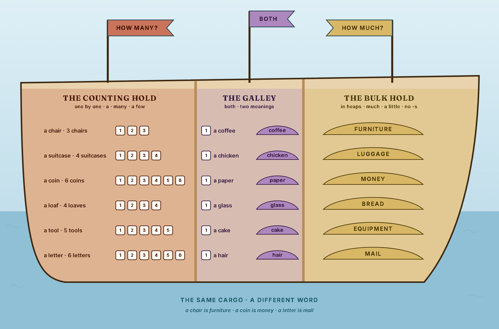
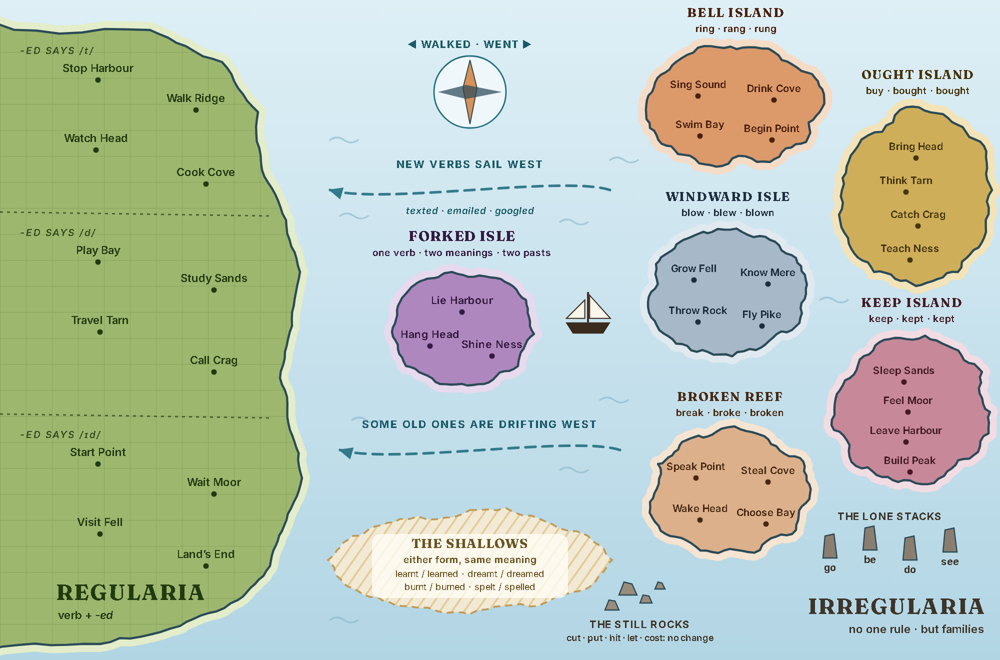

# Artwork: three more sea charts for Sailing the Seas of Grammar

Innes, 2026-09-30: *"make extra maps with nautical theme like gerundia
infinitivia but for countable and uncountable nouns although perhaps that can
also be two pictures of rooms full of one or the other with a interim space
where they share stuff, also possible for regular and irregular verbs"*.
Then: *"both in one lesson"*, *"the rooms can be in a ship"*, and *"I will
make the images on request using midjourney … I planned to upgrade whatever
you made anyway but I was specially talking about the countable noun
images"*.

So the work is split:

- **The two maps are painted in code** by `lesson-template/build/sea_charts.py`
  and `sea_paint.py`. They have parchment, a ruled border with a degree band,
  water lines along every coast, hatched cliffs, terrain and a compass rose.
  They are finished art and can be upgraded later.
- **The countable-noun picture, the ship's hold, is Innes's**, made in
  ChatGPT from `docs/CHATGPT-SEA-CHARTS-BRIEF.md` (he first said Midjourney,
  then on 2026-10-04 *"make it for chat gpt"*). The coded hold stands in
  until it arrives.

Everything is written by a separate label layer, never by the painting. That
keeps the words translatable and lets the page switch between place names
and bare nouns. It also means any upgrade that keeps the coastlines keeps
every label.

## The builder, and its check

```bash
py lesson-template/build/sea_charts.py
```

This writes each chart to `docs/sea-charts/` as `<name>.svg` / `.png`
(labelled) and `<name>-plain.svg` / `.png` (paint only). It exits non-zero if
any of these happen:

- a harbour name leaves its coast, or a caption on the hold leaves the hull
- a caption meant for open water touches a beach
- two labels touch
- anything runs under the ruled border

The measurements are taken in headless Chromium against the real glyphs and
coastlines. The check was run against deliberately broken copies and failed
on each of them.

The terrain is part of the grammar:

- **Countania** is planted in square orchards of exactly nine trees, with
  separate farmhouses. Everything there can be counted.
- **Uncountania** is wheat and dunes, stuff you can only measure.
- **Regularia** is a tidy grid of fields.
- **Each irregular island** has its own landmark: I·A·U Island a bell tower,
  -EW Island a windmill, -T Island a castle keep, -EN Island a wreck.

`terrain()` never plants anything inside a label's box.

## 1. `countable-chart`: Countania and Uncountania



| On the chart | What it teaches |
|---|---|
| **Countania** (brick, west) | *a / an · many · a few · -s* |
| **Uncountania** (wheat, east) | *much · a little · no a / an · no -s* |
| **Paired harbours** | Each uncountable harbour faces its countable partner at the same latitude, with the same surname: *Furniture Crag ↔ Chair Crag, Information Point ↔ Fact Point, Advice Head ↔ Tip Head, Luggage Sands ↔ Suitcase Sands*. Twelve pairs: work/job, information/fact, advice/tip, luggage/suitcase, furniture/chair, travel/trip, money/coin, music/song, equipment/tool, weather/storm, homework/task, progress/step. The trap is on the east shore. The way out is directly across the water. |
| **Double Isle** (lilac) | Both shores, two meanings: coffee, chicken, paper, room, glass, hair, time. Lilac, like Twofold Isle, so "the lilac island is both" holds across the series. |
| **The False Cape** | A spur of Uncountania flying **-S**. *News, maths and physics* look plural but are singular: *the news is*. |
| **The piece-of ferry** | The one way across, west only: *a piece of advice · a bottle of water · a slice of bread*. |
| **The Shallows** | Quantifiers that work on either shore: *some, any, a lot of, plenty of, no, enough, more, most*. |

## 2. `countable-hold`: the rooms, in a ship



The same point shown as rooms. There are two holds, and between them is the
galley, where both kinds of noun sit together.

- **The counting hold** (HOW MANY?): chairs, suitcases, coins, loaves, tools
  and letters. Each one sits apart and carries a tag: *a chair · 3 chairs*.
- **The bulk hold** (HOW MUCH?): the same cargo in heaps, with one word on
  each heap: FURNITURE, LUGGAGE, MONEY, BREAD, EQUIPMENT, MAIL.
- **The galley** (BOTH): one of each thing beside the stuff it is made of:
  *a coffee / coffee*, *a chicken / chicken*, *a paper / paper*,
  *a glass / glass*, *a cake / cake*, *a chocolate / chocolate*. Hair stays
  on the map as Hair Head. A single hair can't be painted recognisably.

In the lesson, the hold comes first because it gives the idea: **the same
cargo, a different word**. Then the map, which is clickable and carries the
nouns and the traps.

## 3. `verbs-chart`: Regularia and the irregular archipelago



| On the chart | What it teaches |
|---|---|
| **Regularia** (green, west) | The biggest land and the smoothest coast on the chart, with one rule: *verb + -ed, and almost every other verb*. Three provinces by sound, six harbours each. **/t/**: Stop Harbour, Walk Ridge, Watch Head, Cook Cove, Like Mere, Laugh Rock. **/d/**: Play Bay, Study Sands, Travel Tarn, Call Crag, Live Ness, Open Sound. **/ɪd/**: Start Point, Wait Moor, Visit Fell, Need Haven, Decide Head, Land's End. The spelling rules are in the names: *stopped* (double), *liked, lived, decided* (just -d), *studied* (y → i), *travelled* (British double l), *opened* (no double, because the stress is on *op-*). |
| **The archipelago** (Irregularia: no one rule, but families) | Each family is an island named after the sound it shares. **I·A·U Island** *ring · rang · rung* (sing, drink, swim, begin). **Ought Island** *buy · bought* (bring, think, catch, teach). **-EW Island** *blow · blew · blown* (grow, know, throw, fly). **-T Island** *keep · kept* (sleep, feel, leave, build). **-EN Island** *speak · spoke · spoken*, where the third form ends in -en (break, take, give, write). |
| **The Still Rocks / the Lone Stacks** | *cut · put · hit · let · cost*, which never change. *go · be · do · see*, which belong to no family. |
| **Forked Isle** (lilac) | One verb, two meanings, two past forms: *lie (lied / lay), hang (hanged / hung), shine (shined / shone)*. |
| **Currents west** | New verbs arrive regular (*texted, emailed, googled*). Some old ones are drifting west too, into the Shallows (*learnt / learned, dreamt / dreamed, burnt / burned, spelt / spelled*). |

*Didn't went* belongs in the lesson, not on the map. It is a rule about
sentences, not a place.

## The pictures: ChatGPT, from `docs/CHATGPT-SEA-CHARTS-BRIEF.md`

Innes, 2026-10-04: *"make it for chat gpt"*. The prompts Innes pastes are in
**`docs/CHATGPT-SEA-CHARTS-BRIEF.md`**, written to ChatGPT, with the images
to attach.

- **The hold is one picture, `hold.png`.** ChatGPT repaints
  `countable-hold-plain.png` with the real objects in place of the
  placeholders and blank tags, and keeps the layout. That way the hold's label
  layer lands without re-fitting. (An earlier plan for Midjourney was three
  separate room pictures. Midjourney does not keep a layout, so every label
  would have had to be re-fitted.)
- **The map upgrades are optional**, done the Gerundia way: the labelled
  repaint first, then a clean copy with the harbour dots kept
  (`countable-chart-clean.png`, `verbs-chart-clean.png`). Blob-detect the
  dots on the clean copy and move the place coordinates in `sea_charts.py`
  to match, as `eb491249` did for `sailing_map.py`.

Everything lands in **`incoming/sea-charts/`**. The folder exists on Innes's
machine (created 2026-10-04). `incoming/` is gitignored, so a cloud session
has to ask for it to be made.

## After the rooms arrive (for the session that picks this up)

1. `tools/prep-artwork.py` on each file.
2. Check the hold's label layer (item tags, heap names, galley pairs) against
   the painted objects. ChatGPT keeps a layout closely but not exactly, so
   nudge the coordinates where it drifted, then re-run the page builder.
3. `extract-palette.py` on the lesson's hero, then `build_hubs.py`,
   `seo.py`, and the catalogue row.
